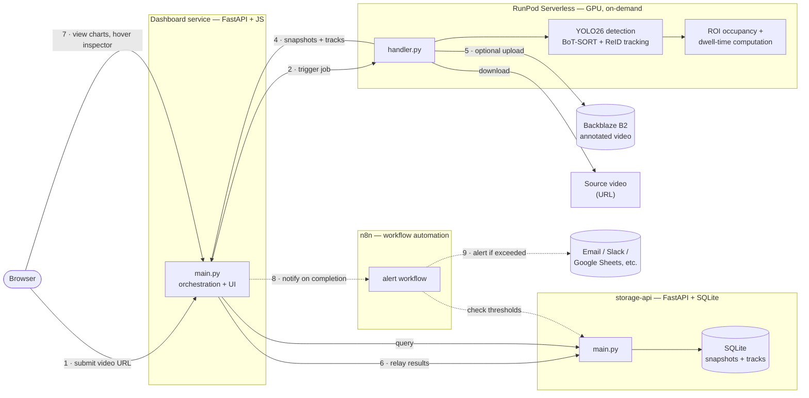

# Queue Analysis

**Automated, end-to-end queue analytics — from raw video to actionable metrics, with zero manual steps in between.**

A video comes in; a GPU spins up on demand, detects and tracks every person, measures queue occupancy and wait time inside a configurable zone, and stores the results — all triggered by a single API call or a click in the dashboard. No GPU runs idle, no step requires a human in the loop.

[](https://www.python.org/)
[](https://fastapi.tiangolo.com/)
[](https://docs.docker.com/compose/)
[](https://docs.ultralytics.com/)
[](https://www.runpod.io/)
[](https://n8n.io/)
[](LICENSE)

---

## How it works

1. A video is submitted (by URL) to the **dashboard**.
2. The dashboard triggers a **RunPod Serverless** job — a GPU worker spins up **only for the duration of that job**, not 24/7.
3. On the GPU: **YOLO26** detects every person, **BoT-SORT + ReID** tracks them frame to frame, and each track is checked against a configurable **region of interest (ROI)** to determine queue occupancy and per-person dwell time.
4. Results (per-frame occupancy, per-person dwell time, optional annotated video) are relayed into **storage-api**, a dedicated service that owns the database exclusively.
5. The dashboard queries storage-api and renders interactive charts — including a hover inspector that shows exactly which track IDs were inside vs. outside the ROI at any 0.1s instant.
6. Optionally, an **n8n** workflow watches job results and sends an alert automatically when a threshold is crossed (e.g. queue peak too high) — no one has to check the dashboard for it to be noticed.

Every step above runs automatically end-to-end from a single request — nothing is manually stitched together.



---

## Key features

- **On-demand GPU, not 24/7** — RunPod Serverless spins up a worker per job and shuts it down after; cost scales with actual usage, not wall-clock time.
- **Cost-engineered pipeline** — configurable frame-rate sampling (`target_fps`), zero-copy frame skipping (`cap.grab()`/`retrieve()`), and an `annotate` toggle to skip rendering/upload entirely when only metrics are needed. Combined, these cut per-job GPU time by roughly 10x on the reference video.
- **Correctness-first tracking** — a fresh tracker is instantiated per job (not reused across unrelated videos on a warm worker), eliminating identity leakage between jobs.
- **Interactive analytics dashboard** — occupancy-over-time and dwell-time charts built from scratch in SVG (no charting library, no CDN dependency), with a Google-Analytics-style hover readout showing the exact track IDs inside/outside the ROI at any sampled instant.
- **Track-quality diagnostics** — a standalone analysis pass (`app/track_diagnostics.py`) classifies every lost track as occlusion-plausible or an unexplained "phantom" switch (zero box overlap with anyone else), and flags high-overlap identity-crossing events — turning "the tracker feels glitchy" into a measured percentage.
- **Two-service architecture with a single source of truth** — `storage-api` is the only thing that ever touches the SQLite file; every other service talks to it over HTTP, avoiding SQLite's multi-writer/locking pitfalls entirely.
- **Automated alerting via n8n** — a self-hosted n8n instance watches job results and sends a notification (email, with Slack/Google Sheets as natural next steps) automatically when a configured threshold is crossed, with no manual monitoring.
- **One-command local orchestration** — `docker-compose up` brings up the dashboard, storage layer, and automation layer, all networked together, with named volumes so data and workflows survive restarts.

---

## Architecture

| Component | Role | Stack |
|---|---|---|
| **`handler.py`** (RunPod) | Downloads video, runs detection + tracking, computes occupancy/dwell metrics, optionally uploads annotated output | Python, Ultralytics YOLO26, BoT-SORT, OpenCV, boto3 |
| **`app/queue_management.py`** | Core video-processing pipeline: config loading, frame-rate control, ROI containment, track lifecycle (entry/exit → dwell time) | Python, OpenCV, NumPy |
| **`app/track_diagnostics.py`** | Standalone tracking-quality analysis: occlusion vs. phantom ID loss, identity-crossing detection | Python |
| **`storage-api/`** | Sole owner of the database; REST API for snapshots, tracks, per-job aggregates | FastAPI, aiosqlite (async SQLite) |
| **`dashboard/`** | Triggers jobs, relays results into storage-api, renders interactive charts | FastAPI, vanilla JS, hand-built SVG charts |
| **`submit_job.py`** | CLI alternative to the dashboard — submit a job and relay results from the terminal | Python, requests |
| **Backblaze B2** | S3-compatible object storage for annotated output video | boto3 |
| **n8n** | Workflow automation: watches job results and sends alerts when a threshold is crossed | n8n (self-hosted), SMTP |
| **`docker-compose.yml`** | Local orchestration of `storage-api` + `dashboard` + `n8n`, networked, with persistent named volumes | Docker Compose |

---

## Getting started

### Prerequisites

- Docker + Docker Compose
- A [RunPod](https://www.runpod.io/) account with a Serverless endpoint deployed from this repo's root `Dockerfile` (GPU-side)
- A Backblaze B2 (or other S3-compatible) bucket, with an **application key** (not the account's master key — the S3-compatible API doesn't accept master keys)

### Environment variables

| Variable | Used by | Purpose |
|---|---|---|
| `RUNPOD_API_KEY` | dashboard | Authenticates requests to your RunPod endpoint |
| `RUNPOD_ENDPOINT_ID` | dashboard | Identifies which RunPod Serverless endpoint to call |
| `BUCKET_ENDPOINT_URL` | RunPod handler | Backblaze B2 S3-compatible endpoint |
| `BUCKET_ACCESS_KEY_ID` / `BUCKET_SECRET_ACCESS_KEY` | RunPod handler | B2 application key (not the master key) |
| `STORAGE_API_URL` | dashboard | Set automatically by Compose (`http://storage-api:8000`) |
| `N8N_TIMEZONE` | n8n | Timezone for schedule-based workflows (defaults to UTC) |

### Run the local services

```bash
git clone https://github.com/alireza-keivan/queue-analysis.git
cd queue-analysis
export RUNPOD_API_KEY=...
export RUNPOD_ENDPOINT_ID=...
docker compose up -d --build
```

Dashboard: **http://localhost:8080**
storage-api (direct access, for debugging): **http://localhost:8000**
n8n (workflow automation): **http://localhost:5678**

---

## Usage

**Via the dashboard** — open http://localhost:8080, paste a video URL, set the target FPS and whether to keep the annotated output, and click **Run analysis**. Results appear automatically: occupancy chart, dwell-time histogram, and a per-job track table. Hover the occupancy chart to see exactly which track IDs were in/out of the ROI at any instant.

**Via the CLI:**
```bash
python submit_job.py https://example.com/video.mp4
```

**Directly against RunPod:**
```bash
curl -X POST "https://api.runpod.ai/v2/${RUNPOD_ENDPOINT_ID}/runsync" \
  -H "Authorization: Bearer ${RUNPOD_API_KEY}" \
  -H "Content-Type: application/json" \
  -d '{"input": {"video_url": "https://example.com/video.mp4", "target_fps": 10, "annotate": true}}'
```

---

## Project structure

```
queue_analysis/
├── app/
│   ├── queue_management.py   # core pipeline: config, ROI, tracking, dwell time
│   ├── track_diagnostics.py  # occlusion vs. phantom ID-switch analysis
│   ├── queue.yaml             # model, tracker, ROI, and fps configuration
│   └── trackers/               # BoT-SORT / ByteTrack tuning
├── handler.py                 # RunPod Serverless entry point
├── Dockerfile                 # GPU image for RunPod
├── storage-api/                # owns the SQLite database exclusively
│   ├── main.py  db.py  models.py
│   └── Dockerfile
├── dashboard/                  # orchestration UI
│   ├── main.py
│   └── static/  (index.html, app.js, style.css)
├── submit_job.py               # CLI job submission + storage relay
└── docker-compose.yml          # local orchestration
```

---

## Known limitations

- No continuous/live camera ingestion yet — video is submitted by URL per job, not streamed from a live source.
- Tracking accuracy degrades in dense, closely-crossing crowds; `app/track_diagnostics.py` exists specifically to measure this rather than paper over it.
- SQLite is appropriate at current scale (single-writer, owned exclusively by `storage-api`) but would need to move to a concurrent-writer database (e.g. Postgres) if multiple simultaneous camera sources are added.

## Roadmap

- Continuous/RTSP ingestion as the "record" half of a record-then-batch architecture.
- Extend `track_diagnostics.py` to detect identity oscillation between two already-existing tracks (not just brand-new-ID phantom switches).
- Additional n8n workflows: a Google Sheets audit log per job, and a self-monitoring workflow that alerts if `storage-api` or `dashboard` itself goes down.
- Multi-camera support.

## License

[MIT](LICENSE)