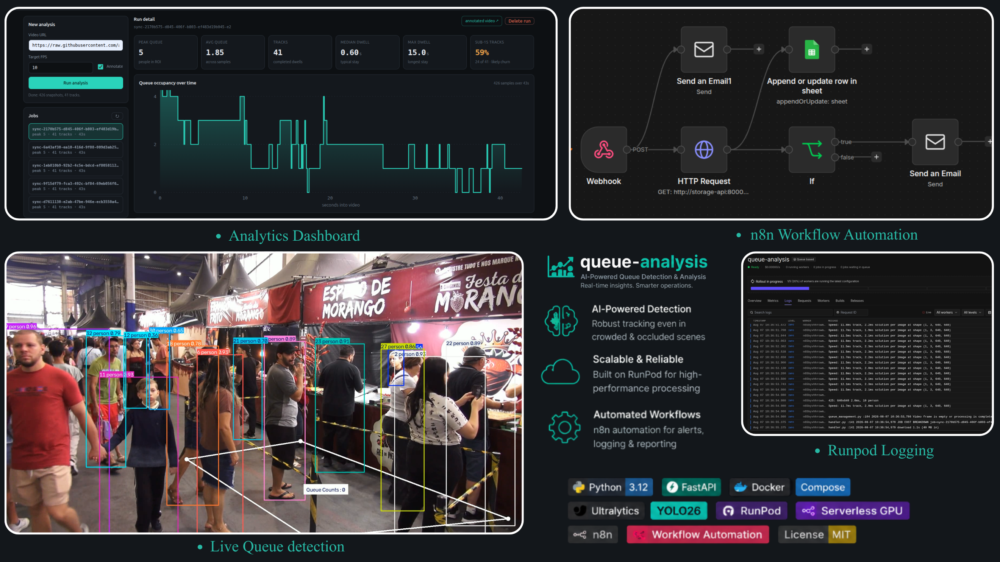
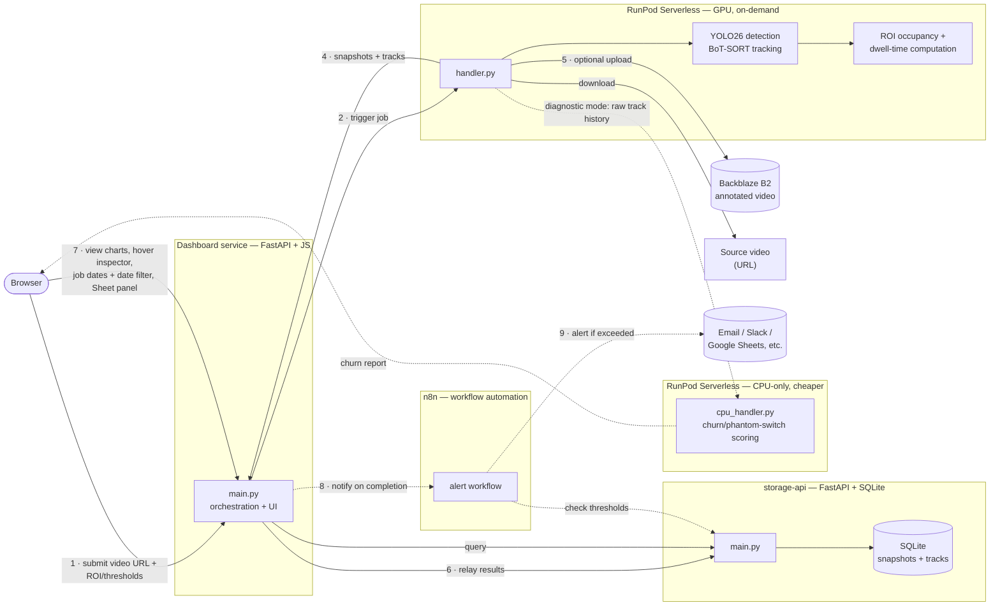
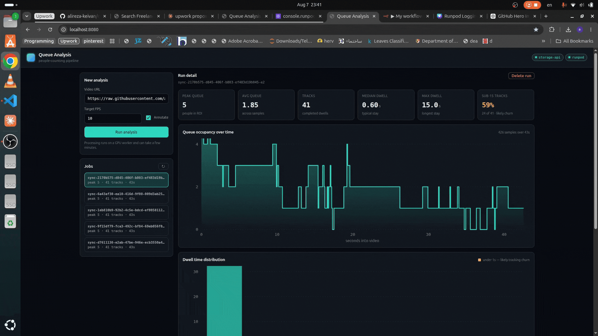
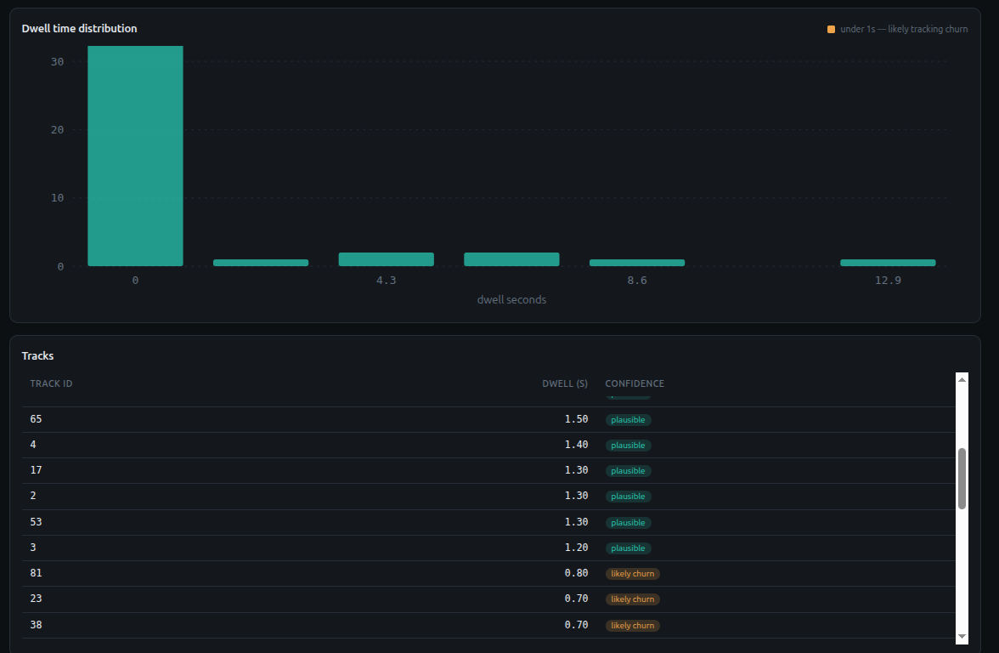
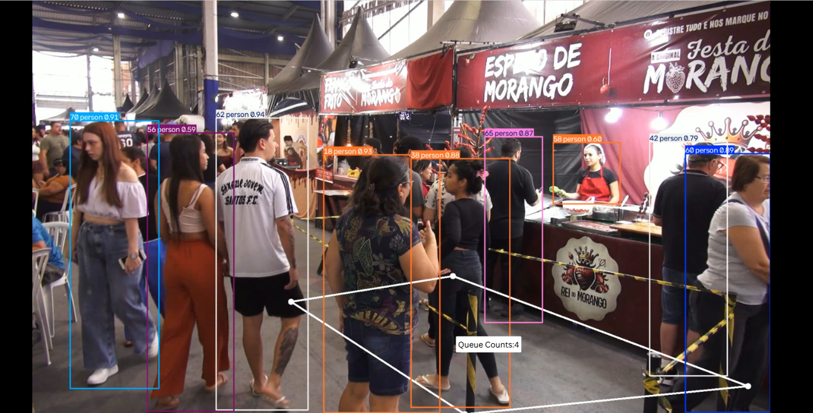
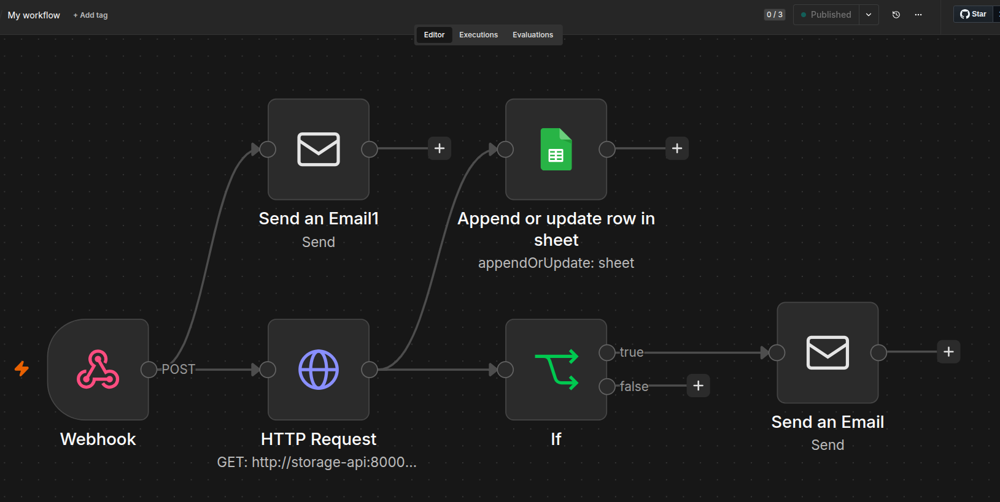
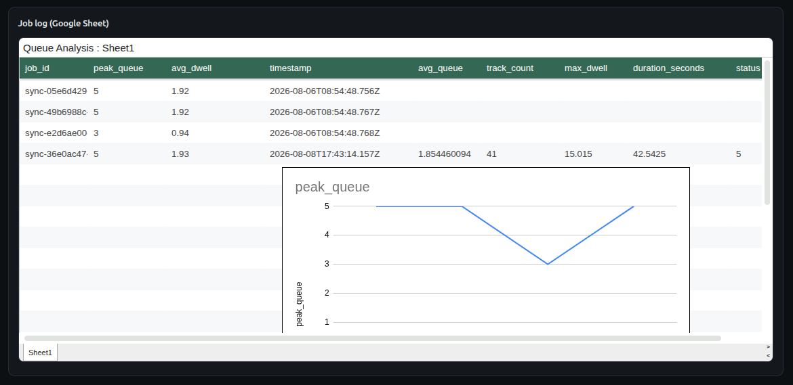

# Queue Analysis

**Automated, end-to-end queue analytics — from raw video to actionable metrics, with zero manual steps in between.**

A video comes in; a GPU spins up on demand, detects and tracks every person, measures queue occupancy and wait time inside a zone a client can draw themselves, and stores the results — all triggered by a single API call or a click in the dashboard. No GPU runs idle, no step requires a human in the loop.

[](https://www.python.org/)
[](https://fastapi.tiangolo.com/)
[](https://docs.docker.com/compose/)
[](https://docs.ultralytics.com/)
[](https://www.runpod.io/)
[](https://n8n.io/)
[](LICENSE)

<!-- PLACEHOLDER — hero image or GIF: the dashboard with a real job open (tiles + occupancy chart visible).
     This is the first thing a visitor sees; pick the most visually complete screenshot you have.
     Drop the file at docs/screenshots/hero.png (or .gif) and this line renders automatically. -->


<!-- PLACEHOLDER — 60-90s walkthrough video (submit a video → watch it process → charts populate → hover the chart → an alert fires).
     A plain committed .mp4 will NOT autoplay/embed on GitHub - either:
       (a) drag the file directly into this README's edit box on github.com to get a real inline player, or
       (b) host on YouTube (unlisted) / Loom and replace the line below with a thumbnail image linking out.
     Delete this comment and the line below once you have one. -->
**[▶ Watch the demo](#)**

---

## How it works

1. A video is submitted (by URL) to the **dashboard**. Before submitting, a client can draw the **region of interest (ROI)** directly on a real frame of that video, and optionally override detection confidence / IOU thresholds — entirely in the browser, no server round-trip needed to preview a frame.
2. The dashboard triggers a **RunPod Serverless** job — a GPU worker spins up **only for the duration of that job**, not 24/7 — carrying the ROI/thresholds as request parameters. Nothing is written to a config file: `queue.yaml` stays the fallback default, and every job can override it independently with no redeploy.
3. On the GPU: **YOLO26** detects every person, **BoT-SORT** tracks them frame to frame, and each track is checked against the ROI to determine queue occupancy and per-person dwell time.
4. Results (per-frame occupancy, per-person dwell time, optional annotated video) are relayed into **storage-api**, a dedicated service that owns the database exclusively.
5. The dashboard queries storage-api and renders interactive charts — including a hover inspector that shows exactly which track IDs were inside vs. outside the ROI at any 0.1s instant — plus a job list with exact submission timestamps and date-range filtering, and a live embedded view of the Google Sheet n8n logs every job to.
6. Optionally, an **n8n** workflow watches job results and sends an alert automatically when a threshold is crossed (e.g. queue peak too high) — no one has to check the dashboard for it to be noticed.

Every step above runs automatically end-to-end from a single request — nothing is manually stitched together.

**A separate CPU-only path exists for tracker diagnostics** (see [Key features](#key-features)): the GPU worker only ever collects raw per-frame track boxes, and the actual churn/phantom-switch analysis — pure Python math, no model, no cv2 — runs on a second, cheaper RunPod endpoint with no GPU attached at all.



---

## Key features

- **On-demand GPU, not 24/7** — RunPod Serverless spins up a worker per job and shuts it down after; cost scales with actual usage, not wall-clock time.
- **Cost-engineered pipeline, backed by real numbers** — configurable frame-rate sampling (`target_fps`), zero-copy frame skipping (`cap.grab()`/`retrieve()`), and an `annotate` toggle to skip rendering/upload entirely when only metrics are needed. Measured on the reference video:

  ```
  JOB COST BREAKDOWN
    download    2.6s   (40 MB in)
    model load  2.9s   <- paid on every job, by design (see Known limitations)
    processing 38.4s
    upload      7.2s   (53 MB out)
    TOTAL      51.1s   (non-processing overhead: 25%)
  ```
  Frame-rate tuning alone cut per-job GPU time by roughly **10x** on this video. Profiling also showed tracking (BoT-SORT + ReID), not YOLO inference, was the dominant per-frame cost — `with_reid` was subsequently A/B tested and switched off (`app/trackers/botsort.yaml`), cutting that further.

- **CPU/GPU cost separation, not just annotation** — work that never touches the model doesn't run on the GPU-billed worker. Tracker diagnostics (`app/track_diagnostics.py`) are split into a GPU-bound collection pass (`collect_track_history`) and a pure-Python scoring pass (`score_track_churn`) with zero cv2/model imports; the scoring half runs on `cpu_handler.py`, deployed as a **second, CPU-only RunPod Serverless endpoint**.
- **Per-job ROI and detection thresholds, no redeploy** — the ROI polygon and confidence/IOU thresholds are picked in the browser (a `<canvas>` overlay on the actual video frame, decoded natively by the browser — zero extra server cost) and ride along in that one job's request. `queue.yaml`'s values are only ever the fallback default; nothing is written to any file, so a client's setting takes effect on their very next submission.
- **Correctness-first tracking** — a fresh tracker is instantiated per job (not reused across unrelated videos on a warm worker), eliminating identity leakage between jobs.
- **Interactive analytics dashboard** — occupancy-over-time and dwell-time charts built from scratch in SVG (no charting library, no CDN dependency), with a Google-Analytics-style hover readout showing the exact track IDs inside/outside the ROI at any sampled instant. The job list shows exact submission timestamps (down to the second) with date-range filtering, and a live Google Sheet — the same one n8n logs every job into — is embedded directly in the dashboard.
- **Track-quality diagnostics, measured not guessed** — a standalone analysis pass (`app/track_diagnostics.py`) classifies every lost track as occlusion-plausible or an unexplained "phantom" switch, and flags high-overlap identity-crossing events. Real output from the reference video:

  ```
  total_distinct_ids: 88          track_endings_analyzed: 78
  occlusion_plausible_endings: 63 (81%)
  phantom_endings_no_overlap: 15  (19%)   <- zero physical explanation, not a guess
  crossing_events: 924            (107 unique id-pairs)
  ```
  Turning "the tracker feels glitchy" into a measured percentage is the difference between debugging by feel and debugging with evidence.

- **Two-service architecture with a single source of truth** — `storage-api` is the only thing that ever touches the SQLite file; every other service talks to it over HTTP, avoiding SQLite's multi-writer/locking pitfalls entirely. Its schema evolves through actual migrations (`storage-api/db.py`), not `CREATE TABLE IF NOT EXISTS` alone — which silently never updates a database that already exists, a real bug this project hit and fixed.
- **Authenticated internally** — `storage-api` requires a shared-secret header on every route (fails closed if unset, not open), since it's reachable from other containers on the network. Every internal caller, including the n8n workflow, must carry it.
- **Failures say what actually broke** — the dashboard surfaces the real upstream cause (storage-api unreachable, a specific query failure, a RunPod error) as a legible message instead of a bare, unexplained `500`.
- **Automated alerting via n8n** — a self-hosted n8n instance watches job results and sends a notification (email, plus a Google Sheets audit log) automatically when a configured threshold is crossed, with no manual monitoring.
- **One-command local orchestration** — `docker-compose up` brings up the dashboard, storage layer, and automation layer, all networked together, with named volumes so data and workflows survive restarts.

---

## Screenshots

<!-- PLACEHOLDER gallery. Suggested filenames below already match what's referenced -
     drop a file at each path and it renders with no further README edits needed. -->

**Interactive occupancy chart — hover inspector**
<!-- Must be a GIF, not a static image - the point is showing the hover interaction itself. -->


**Dwell-time distribution and per-track breakdown**


**Annotated output — detection, tracking IDs, and ROI overlay on real footage**


**n8n automation workflow**


**Google Sheets audit log**


---

## Architecture

| Component | Role | Stack |
|---|---|---|
| **`handler.py`** (RunPod, GPU) | Downloads video, runs detection + tracking, computes occupancy/dwell metrics, optionally uploads annotated output. Accepts per-job `region`/`conf`/`iou` overrides | Python, Ultralytics YOLO26, BoT-SORT, OpenCV, boto3 |
| **`cpu_handler.py`** (RunPod, CPU-only) | Second, cheaper Serverless endpoint: scores tracker-diagnostic churn/phantom-switch data collected by the GPU worker. No cv2, no torch, no ultralytics in this image | Python, `runpod` SDK only |
| **`app/queue_management.py`** | Core video-processing pipeline: config loading, frame-rate control, ROI containment, track lifecycle (entry/exit → dwell time) | Python, OpenCV, NumPy |
| **`app/track_diagnostics.py`** | Tracking-quality analysis, split into a GPU-bound collection pass and a pure-CPU scoring pass: occlusion vs. phantom ID loss, identity-crossing detection | Python |
| **`storage-api/`** | Sole owner of the database; authenticated REST API for snapshots, tracks, per-job aggregates (including submission time); migrates its own schema on startup | FastAPI, aiosqlite (async SQLite) |
| **`dashboard/`** | Triggers jobs (with browser-picked ROI/thresholds), relays results into storage-api, renders interactive charts, job-date filtering, and an embedded Google Sheet | FastAPI, vanilla JS, hand-built SVG charts |
| **Backblaze B2** | S3-compatible object storage for annotated output video | boto3 |
| **n8n** | Workflow automation: watches job results, logs every job to a Google Sheet, and sends alerts when a threshold is crossed | n8n (self-hosted), SMTP, Google Sheets |
| **`docker-compose.yml`** | Local orchestration of `storage-api` + `dashboard` + `n8n`, networked, with persistent named volumes | Docker Compose |

---

## Getting started

### Prerequisites

- Docker + Docker Compose
- A [RunPod](https://www.runpod.io/) account with a Serverless endpoint deployed from this repo's root `Dockerfile` (GPU-side)
- Optionally, a **second** RunPod Serverless endpoint deployed from `Dockerfile.cpu` on a CPU-only worker type, for scoring tracker diagnostics without paying GPU rate for pure Python (see [Usage](#usage))
- A Backblaze B2 (or other S3-compatible) bucket, with an **application key** (not the account's master key — the S3-compatible API doesn't accept master keys)

### Environment variables

| Variable | Used by | Purpose |
|---|---|---|
| `RUNPOD_API_KEY` | dashboard | Authenticates requests to your RunPod endpoint |
| `RUNPOD_ENDPOINT_ID` | dashboard | Identifies which RunPod Serverless endpoint to call |
| `BUCKET_ENDPOINT_URL` | RunPod handler | Backblaze B2 S3-compatible endpoint |
| `BUCKET_ACCESS_KEY_ID` / `BUCKET_SECRET_ACCESS_KEY` | RunPod handler | B2 application key (not the master key) |
| `STORAGE_API_URL` | dashboard | Set automatically by Compose (`http://storage-api:8000`) |
| `STORAGE_API_SECRET` | dashboard + storage-api | Shared secret required on every storage-api request; compose refuses to start without it |
| `N8N_WEBHOOK_URL` | dashboard | n8n's webhook Production URL, pinged after each job completes |
| `N8N_TIMEZONE` | n8n | Timezone for schedule-based workflows (defaults to UTC) |
| `GOOGLE_SHEET_EMBED_URL` | dashboard | Optional. A Google Sheet's *File → Share → Publish to web → Embed* URL (not the normal share link) — shown live in the dashboard when set; the panel stays hidden otherwise |

> **n8n note:** `storage-api`'s auth applies to every internal caller, including n8n's own workflow. Its `HTTP Request` node must send the same `STORAGE_API_SECRET` as an `X-API-Key` header, set manually in the n8n editor (*node → Send Headers → Add Header*) — this lives inside the workflow itself, not in an env var, so it isn't tracked anywhere in this repo and won't survive recreating the workflow from scratch.

### Run the local services

```bash
git clone https://github.com/alireza-keivan/queue-analysis.git
cd queue-analysis
export RUNPOD_API_KEY=...
export RUNPOD_ENDPOINT_ID=...
export STORAGE_API_SECRET=...   # any random string; storage-api and dashboard must share it
docker compose up -d --build
```

Dashboard: **http://localhost:8080**
storage-api (direct access, for debugging): **http://localhost:8000**
n8n (workflow automation): **http://localhost:5678**

---

## Usage

**Via the dashboard** — open http://localhost:8080, paste a video URL, set the target FPS and whether to keep the annotated output, and click **Run analysis**. Results appear automatically: occupancy chart, dwell-time histogram, and a per-job track table. Hover the occupancy chart to see exactly which track IDs were in/out of the ROI at any instant.

**Setting a custom ROI and thresholds** — click **Preview & set ROI** before submitting: the video loads directly in the browser, click 3+ points on the frame to draw the queue polygon (a seek slider helps land on a frame with people visible), and optionally expand **Advanced settings** to override confidence/IOU for that job only. Leave either blank to fall back to `queue.yaml`'s defaults. Nothing is written to any file — the values are sent with that one job's request.

**Filtering jobs by date** — the job list has two date inputs (from/to); set either to narrow what's shown, or clear them to see everything again.

**Running tracker diagnostics on the CPU-only endpoint** — this is a two-call flow, since the GPU worker only ever collects raw data and never scores it:
```bash
# 1. GPU endpoint: collect per-frame track history (needs the model)
curl -X POST "https://api.runpod.ai/v2/${RUNPOD_ENDPOINT_ID}/runsync" \
  -H "Authorization: Bearer ${RUNPOD_API_KEY}" -H "Content-Type: application/json" \
  -d '{"input": {"video_url": "https://example.com/video.mp4", "diagnostic": true}}' \
  > collected.json

# 2. CPU-only endpoint: score it (pure Python, no model, billed at CPU rate)
curl -X POST "https://api.runpod.ai/v2/${RUNPOD_CPU_ENDPOINT_ID}/runsync" \
  -H "Authorization: Bearer ${RUNPOD_API_KEY}" -H "Content-Type: application/json" \
  -d "{\"input\": {\"task\": \"score_diagnostic\", $(python3 -c "
import json; d = json.load(open('collected.json'))['output']
print(f'\"history\": {json.dumps(d[\"history\"])}, \"stride\": {d[\"stride\"]}, \"src_fps\": {d[\"src_fps\"]}')
")}}"
```

**Directly against RunPod** (what the dashboard itself calls under the hood):
```bash
curl -X POST "https://api.runpod.ai/v2/${RUNPOD_ENDPOINT_ID}/runsync" \
  -H "Authorization: Bearer ${RUNPOD_API_KEY}" \
  -H "Content-Type: application/json" \
  -d '{"input": {"video_url": "https://example.com/video.mp4", "target_fps": 10, "annotate": true,
       "region": [[673, 785], [1125, 1078], [1862, 1005], [1094, 718]], "conf": 0.35, "iou": 0.70}}'
```

---

## Project structure

```
queue_analysis/
├── app/
│   ├── queue_management.py   # core pipeline: config, ROI, tracking, dwell time
│   ├── track_diagnostics.py  # collection (GPU) + scoring (pure CPU) for tracker diagnostics
│   ├── queue.yaml             # model, tracker, ROI, and fps configuration (fallback defaults)
│   └── trackers/               # BoT-SORT tuning (with_reid, thresholds)
├── handler.py                 # RunPod Serverless entry point - GPU worker
├── Dockerfile                  # GPU image for RunPod
├── cpu_handler.py              # RunPod Serverless entry point - CPU-only worker
├── Dockerfile.cpu               # lean, no-GPU-deps image for the CPU worker
├── requirements-cpu.txt
├── storage-api/                # owns the SQLite database exclusively
│   ├── main.py  db.py  models.py   # db.py includes schema migrations
│   └── Dockerfile
├── dashboard/                  # orchestration UI
│   ├── main.py
│   └── static/  (index.html, app.js, style.css)   # incl. the ROI/config picker
├── docs/screenshots/           # README media
└── docker-compose.yml          # local orchestration
```

---

## Known limitations

- No continuous/live camera ingestion yet — video is submitted by URL per job, not streamed from a live source.
- Tracking accuracy degrades in dense, closely-crossing crowds; `app/track_diagnostics.py` exists specifically to measure this rather than paper over it.
- SQLite is appropriate at current scale (single-writer, owned exclusively by `storage-api`) but would need to move to a concurrent-writer database (e.g. Postgres) if multiple simultaneous camera sources are added.
- No automated test suite yet over the pure-function logic (ROI containment, dwell-time lifecycle, frame-stride math).
- The ROI *position* is client-configurable per job; the containment *rule* itself (point-in-polygon, one rule type) is not yet — see roadmap.
- n8n's auth header (see the note in [Environment variables](#environment-variables)) lives inside the workflow, not in code — it doesn't survive rebuilding the workflow from scratch and isn't something this repo can enforce.

## Roadmap

- Continuous/RTSP ingestion as the "record" half of a record-then-batch architecture.
- Extend `track_diagnostics.py` to detect identity oscillation between two already-existing tracks (not just brand-new-ID phantom switches).
- Re-profile now that `with_reid` is off to get a fresh per-stage cost breakdown, and use it to decide whether a two-pass pipeline (batch GPU detection, then CPU-side association) is still worth the added complexity.
- Extend the CPU/GPU split beyond diagnostics into the main pipeline — annotation rendering currently still runs on the GPU worker by design (kept for client-facing testing for now); moving it to the CPU-only endpoint once that need passes would remove another GPU-billed non-GPU cost.
- Additional n8n workflows: a self-monitoring workflow that alerts if `storage-api` or `dashboard` itself goes down.
- Multi-camera support.
- Generalize the ROI containment check from a single hardcoded rule *type* into a configurable rule set — position is already client-configurable (see Key features), but the underlying pattern (track lifecycle → event → rule check) extends naturally to classifying arbitrary events against custom reference criteria, not just "inside this polygon."

## License

[MIT](LICENSE)